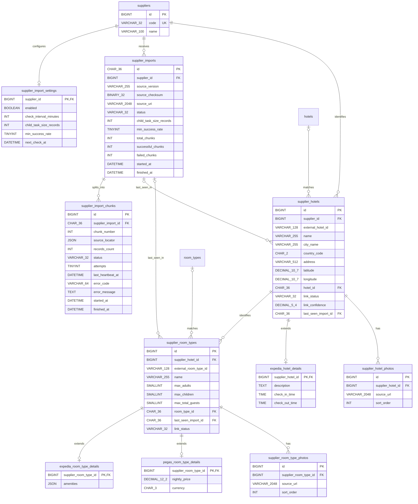

# Проектирование: импорт каталогов поставщиков

## Контекст из чата о system design

- Поставщик 1 передаёт потенциально многомиллионный каталог в формате NDJSON: отели, типы номеров, удобства и ссылки на фотографии. Отдельно у него есть API актуальных предложений; это API не входит в импорт файлов.
- Поставщик 2 ежедневно публикует XML-каталог размером в десятки тысяч отелей. В документе есть отели, типы номеров и цена за ночь. Его API умеет только бронировать; цена из файла не подтверждает доступность.
- Пользователь предложил хранить родительские задачи импорта и дочерние задачи chunks в MySQL, создавать родительские задачи по расписанию и обрабатывать chunks параллельно.
- Текущая договорённость по поведению: воркер переводит захваченную задачу в `in_progress`; отсутствие heartbeat более пяти минут делает задачу кандидатом на повтор; после пяти повторов сверх первой попытки задача получает `error`.
- Для поставщика настраиваются включение импорта, интервал проверки источника, размер дочерней задачи и минимальная доля успешных дочерних задач; начальный порог — 80%.
- Рассматривается использование Laravel Queue с MySQL backend и `Bus::batch`, чтобы не реализовывать собственный polling worker. Выбор между Laravel Queue и собственной очередью над таблицами пока не зафиксирован. Также не решено, как требование heartbeat со сроком пять минут будет реализовано поверх Laravel Queue.
- Обработка должна допускать повторное выполнение и быть идемпотентной. RabbitMQ не входит в первый этап.
- Для хранения выбрано гибридное направление: общая модель внешней сущности поставщика плюс отдельные таблицы специфичных данных источника. Конкретная схема ниже подготовлена на согласование.
- Для удобства поставщики получают коды `expedia` и `pegas`; числовые ID остаются внутренними surrogate keys.

## Предлагаемые границы

~~~text
Reader формата в SupplierIntegration
        ↓ записи в формате источника
Управление импортом и chunks в Import
        ↓ проверенные записи источника
Хранение данных поставщика / staging
        ↓ публичный контракт на следующем этапе
Matching → канонический Catalog
~~~

- Import отвечает за жизненный цикл загрузки, постановку и захват chunks, повторы и итоговую оценку полноты импорта.
- Supplier-specific readers знают формат файла и преобразуют его в типизированные записи источника. Не нужно создавать один большой интерфейс, который также включает поиск доступности и бронирование.
- Catalog остаётся владельцем канонических отелей и типов номеров. Import не обращается к приватным классам другого модуля; для связи с Matching и Catalog позднее потребуется явный публичный контракт.

## Предлагаемый цикл импорта

1. Создать import batch для поставщика и версии входного файла; сохранить контрольную сумму и ссылку на источник.
2. Проверить, что файл можно прочитать. Для уже успешно обработанной контрольной суммы определить явное поведение: отклонить повторный импорт либо безопасно переиспользовать результат.
3. Подготовить ограниченные по размеру chunks. NDJSON можно делить на границах записей. XML нужно читать потоком: одна физическая строка не является границей записи.
4. Выбранный механизм выполнения доставляет дочернюю задачу одному воркеру и фиксирует её переход в `in_progress`. При выборе Laravel Queue необходимо сверить время `retry_after` и timeout с максимальной длительностью chunk; при собственной очереди нужно реализовать конкурентный захват и lease.
5. Разбирать, проверять и идемпотентно сохранять записи через upsert по стабильному внешнему ID поставщика. Одновременно выставлять `last_seen_import_id` текущего родительского импорта. Некорректную запись помещать в ограниченную запись карантина с позицией в источнике и причиной ошибки; исходный файл сохранять как диагностический источник.
6. Требуется обнаруживать задачу без heartbeat более пяти минут и безопасно разрешать повторную обработку. Частичное повторное выполнение chunk должно приводить к тому же состоянию staging.
7. После завершения дочерних задач родитель сравнивает долю успешных задач с порогом поставщика (по умолчанию 80%) и получает `done` или `error`.
8. Обработка импортом текущих строк поставщика не означает, что неполные данные следует использовать для деактивации пропавших гостиниц. Это допустимо только после согласованного критерия полноты родительского импорта.
9. Matching и обновление поискового индекса позже получают обновлённые данные через контракты своих модулей; парсер не должен незаметно выполнять их работу.

## Механизм выполнения и воркеры

Обсуждались два варианта:

1. Laravel Queue с MySQL backend: parent/child Jobs, а для группы дочерних задач — `Bus::batch`. Родитель импорта и, если требуется диагностика, записи chunks остаются прикладными данными импорта; таблица `jobs` используется Laravel для доставки и повторов.
2. Собственные долгоживущие Artisan workers, которые опрашивают таблицы родительских и дочерних задач, захватывают записи, продлевают lease и реализуют повторы самостоятельно.

Предварительно предпочтителен первый вариант, так как он использует штатные механизмы Laravel Queue. Для него нужно отдельно проверить требование heartbeat: Laravel Queue использует `retry_after` для повторной доступности зарезервированной задачи, а не автоматический heartbeat прикладной задачи. Если периодический heartbeat остаётся обязательным, понадобится отдельное обновление heartbeat в записи импорта либо иной механизм продления владения.

## Решения, требующие ревью

### Предлагаемая схема хранения данных на ревью

Направление соответствует гибридному варианту: общие таблицы дают единый ID внешнего отеля/типа номера и место для связи с каноническим Catalog; текущие данные поставщика обновляются непосредственно в этих таблицах; extension-таблицы содержат специфичные поля поставщика. `last_seen_import_id` позволяет выявить записи, не встретившиеся в последнем полном импорте. Исходный файл сохраняется отдельно и указывается в `supplier_imports.source_uri`.



Ниже тот же состав в формате каталога таблиц. Типы указаны для MySQL 8; `NULL` отмечает nullable-поле. Все не помеченные `NULL` поля обязательны. `PK`, `FK`, `UNIQUE` и `INDEX` показывают ограничения и индексы.

#### Справочник поставщиков и настройки

```text
suppliers
- id BIGINT UNSIGNED PK AUTO_INCREMENT
- code VARCHAR(32) NOT NULL UNIQUE              -- expedia, pegas
- name VARCHAR(100) NOT NULL                    -- Expedia, Pegas

supplier_import_settings
- supplier_id BIGINT UNSIGNED PK FK -> suppliers.id
- enabled BOOLEAN NOT NULL DEFAULT TRUE
- check_interval_minutes INT UNSIGNED NOT NULL
- child_task_size_records INT UNSIGNED NOT NULL
- min_success_rate TINYINT UNSIGNED NOT NULL DEFAULT 80 -- CHECK 0..100
- next_check_at DATETIME(6) NULL                -- состояние планировщика
```

Начальные данные: `(1, 'expedia', 'Expedia')`, `(2, 'pegas', 'Pegas')`. ID приведены для наглядности; приложение должно искать поставщика по `code` и не полагаться на заранее заданный numeric ID. Строки настроек создаются отдельно, когда согласованы интервал и размер chunk; до этого поставщик не участвует в планировщике.

#### Родительский импорт и дочерние chunks

```text
supplier_imports
- id CHAR(36) PK                                -- UUID
- supplier_id BIGINT UNSIGNED NOT NULL FK -> suppliers.id
- source_version VARCHAR(255) NULL
- source_checksum BINARY(32) NOT NULL           -- SHA-256
- source_uri VARCHAR(2048) NOT NULL
- status VARCHAR(32) NOT NULL
- child_task_size_records INT UNSIGNED NOT NULL -- snapshot настроек
- min_success_rate TINYINT UNSIGNED NOT NULL    -- snapshot настроек, CHECK 0..100
- total_chunks INT UNSIGNED NOT NULL DEFAULT 0
- successful_chunks INT UNSIGNED NOT NULL DEFAULT 0
- failed_chunks INT UNSIGNED NOT NULL DEFAULT 0
- started_at DATETIME(6) NULL
- finished_at DATETIME(6) NULL
- UNIQUE (supplier_id, source_checksum)
- INDEX (supplier_id, status)

supplier_import_chunks
- id BIGINT UNSIGNED PK AUTO_INCREMENT
- supplier_import_id CHAR(36) NOT NULL FK -> supplier_imports.id
- chunk_number INT UNSIGNED NOT NULL
- source_locator JSON NOT NULL                   -- диапазон/позиция для reader
- records_count INT UNSIGNED NOT NULL DEFAULT 0
- status VARCHAR(32) NOT NULL
- attempts TINYINT UNSIGNED NOT NULL DEFAULT 0
- last_heartbeat_at DATETIME(6) NULL
- error_code VARCHAR(64) NULL
- error_message TEXT NULL
- started_at DATETIME(6) NULL
- finished_at DATETIME(6) NULL
- UNIQUE (supplier_import_id, chunk_number)
- INDEX (status, last_heartbeat_at)
```

`supplier_import_chunks` — прикладной журнал состава и результата chunks. При выборе Laravel Queue таблицы `jobs`, `job_batches` и `failed_jobs` остаются транспортными таблицами фреймворка; они не заменяют этот журнал.

#### Текущие записи внешних гостиниц и типов номеров

```text
supplier_hotels
- id BIGINT UNSIGNED PK AUTO_INCREMENT
- supplier_id BIGINT UNSIGNED NOT NULL FK -> suppliers.id
- external_hotel_id VARCHAR(128) NOT NULL
- name VARCHAR(255) NOT NULL
- city_name VARCHAR(255) NOT NULL
- country_code CHAR(2) NOT NULL
- address VARCHAR(512) NULL
- latitude DECIMAL(10,7) NULL
- longitude DECIMAL(10,7) NULL
- hotel_id CHAR(36) NULL FK -> hotels.id       -- UUID канонической гостиницы
- last_seen_import_id CHAR(36) NULL FK -> supplier_imports.id
- link_status VARCHAR(32) NOT NULL
- link_confidence DECIMAL(5,4) NULL
- UNIQUE (supplier_id, external_hotel_id)
- INDEX (hotel_id)
- INDEX (last_seen_import_id)

supplier_room_types
- id BIGINT UNSIGNED PK AUTO_INCREMENT
- supplier_hotel_id BIGINT UNSIGNED NOT NULL FK -> supplier_hotels.id
- external_room_type_id VARCHAR(128) NOT NULL
- name VARCHAR(255) NOT NULL
- max_adults SMALLINT UNSIGNED NULL
- max_children SMALLINT UNSIGNED NULL
- max_total_guests SMALLINT UNSIGNED NULL
- room_type_id CHAR(36) NULL FK -> room_types.id -- UUID канонического типа номера
- last_seen_import_id CHAR(36) NULL FK -> supplier_imports.id
- link_status VARCHAR(32) NOT NULL
- UNIQUE (supplier_hotel_id, external_room_type_id)
- INDEX (room_type_id)
- INDEX (last_seen_import_id)
```

`supplier_hotels` и `supplier_room_types` хранят устойчивую идентичность и актуальные поля поставщика. При повторном импорте текущие поля обновляются на месте, а `last_seen_import_id` получает ID родительского импорта. После достаточно полного импорта записи с другим `last_seen_import_id` можно найти и отдельно решить, как обработать (например, пометить неактивными). Записи нельзя считать пропавшими, если импорт завершился частично или ниже согласованного порога.

#### Поставщицкие расширения и фотографии

```text
expedia_hotel_details
- supplier_hotel_id BIGINT UNSIGNED PK FK -> supplier_hotels.id
- description TEXT NULL
- check_in_time TIME NULL
- check_out_time TIME NULL

expedia_room_type_details
- supplier_room_type_id BIGINT UNSIGNED PK FK -> supplier_room_types.id
- amenities JSON NULL

pegas_room_type_details
- supplier_room_type_id BIGINT UNSIGNED PK FK -> supplier_room_types.id
- nightly_price DECIMAL(12,2) NOT NULL
- currency CHAR(3) NOT NULL

supplier_hotel_photos
- id BIGINT UNSIGNED PK AUTO_INCREMENT
- supplier_hotel_id BIGINT UNSIGNED NOT NULL FK -> supplier_hotels.id
- source_url VARCHAR(2048) NOT NULL
- sort_order INT UNSIGNED NOT NULL DEFAULT 0
- INDEX (supplier_hotel_id, sort_order)

supplier_room_type_photos
- id BIGINT UNSIGNED PK AUTO_INCREMENT
- supplier_room_type_id BIGINT UNSIGNED NOT NULL FK -> supplier_room_types.id
- source_url VARCHAR(2048) NOT NULL
- sort_order INT UNSIGNED NOT NULL DEFAULT 0
- INDEX (supplier_room_type_id, sort_order)
```

В примерах Expedia специфичны описание/время заезда и выезда, удобства комнат и фотографии; у Pegas в текущем примере есть цена за ночь. Её размещение в `pegas_room_type_details` предварительное: если цена зависит от дат, состава гостей, типа питания или тарифа, нужна отдельная сущность предложения/тарифа, а не атрибут типа номера. Таблицу для Pegas hotel details пока не предлагаю: в доступном описании у отеля нет дополнительных полей сверх общей модели. Новые extension-таблицы добавляются при появлении соответствующих реальных данных.

Это схема-кандидат, не утверждённый контракт. На ревью нужно проверить, достаточно ли обновления текущих строк, где хранить дополнительные исходные поля, как связать город поставщика с `cities` и при каких условиях `last_seen_import_id` можно использовать для обработки исчезнувших записей. Правило обработки частично успешного импорта остаётся отдельным открытым решением.

### План первого участка реализации: миграции и модели

Этот участок создаёт persistence foundation модуля Import. Он не реализует расписание, Laravel Queue jobs, парсеры, обработку файлов или upsert большого каталога. Перед кодом требуется одобрить ER-схему и закрыть вопросы, которые влияют на колонки и ограничения.

#### Предлагаемая структура классов

```text
app/Modules/Import/
├── Domain/
│   ├── Model/
│   │   ├── SupplierImport.php
│   │   └── SupplierImportChunk.php
│   ├── ValueObject/
│   │   ├── ImportStatus.php
│   │   ├── ImportChunkStatus.php
│   │   └── SupplierImportSettings.php
│   └── Repository/
│       ├── SupplierImportRepository.php
│       └── SupplierImportChunkRepository.php
├── Application/
│   └── ... (use cases появятся со следующим вертикальным сценарием)
└── Infrastructure/
    └── Persistence/
        └── Eloquent/
            └── Record/
                ├── SupplierRecord.php
                ├── SupplierImportSettingsRecord.php
                ├── SupplierImportRecord.php
                ├── SupplierImportChunkRecord.php
                ├── SupplierHotelRecord.php
                ├── SupplierRoomTypeRecord.php
                ├── ExpediaHotelDetailsRecord.php
                ├── ExpediaRoomTypeDetailsRecord.php
                ├── PegasRoomTypeDetailsRecord.php
                ├── SupplierHotelPhotoRecord.php
                └── SupplierRoomTypePhotoRecord.php
```

- Доменными объектами на первом шаге будут только родительский импорт и дочерний chunk: у них есть состояния, попытки, heartbeat и допустимые переходы. Они не наследуют Eloquent и не знают о БД.
- `ImportStatus` и `ImportChunkStatus` — enum/value types без Laravel-зависимостей. Точный список состояний фиксируется после согласования полного lifecycle; уже согласованные состояния включают `in_progress`, `done` и `error`.
- Настройки импорта пока остаются конфигурационной persistence-моделью: отдельного domain type нет, так как у параметров ещё нет самостоятельного жизненного цикла или бизнес-переходов.
- Остальные Eloquent records — persistence mapping для конфигурационных и каталоговых данных. Для каждой таблицы не создаём отдельную доменную сущность автоматически.
- Порты репозиториев принадлежат Domain (или Application, если команды считают доменную коллекцию неуместной); реализация и mapper — в Infrastructure. Рекомендуется два специализированных репозитория для parent/chunk lifecycle, а bulk catalog upsert позднее вынести в специализированный writer, не прогоняя миллионы строк через `save()`.

#### Маппинг Domain ↔ Eloquent

Репозиторий отвечает за преобразование:

```text
SupplierImportRecord / SupplierImportChunkRecord
    → toDomain(record)
    → доменный метод (startAttempt, heartbeat, finish, fail)
    → запись изменённых полей в record
    → save()
```

Mapper остаётся приватной деталью конкретного репозитория (`toDomain()` и `writeToRecord()`); общий mapper framework и DTO для каждой таблицы не вводятся. Eloquent relations используются для навигации по persistence-графу, но не передаются в Domain. При обработке большого каталога следующая задача будет использовать Query Builder/bulk writer напрямую для гостиниц, номеров, деталей и фото.

Транзакции принадлежат Application use case. Изменение состояния одного chunk вместе с нужным изменением счётчиков parent, если счётчики останутся в схеме, должно быть атомарным. Длительная обработка файла не должна проходить внутри одной транзакции. Heartbeat должен быть коротким обновлением persistence-записи; fencing/проверка владения при фиксации результата проектируются вместе с выбранным механизмом очереди.

#### Порядок миграций

1. `suppliers` и `supplier_import_settings`.
2. `supplier_imports` с FK на поставщика.
3. `supplier_import_chunks` с FK на родительский импорт.
4. `supplier_hotels` с FK на поставщика, каноническую гостиницу и `last_seen_import_id`.
5. `supplier_room_types` с FK на `supplier_hotels`, канонический тип номера и `last_seen_import_id`.
6. Expedia/Pegas extension tables и таблицы фотографий.

Использовать типы FK, соответствующие текущей схеме: `hotels.id` и `room_types.id` — UUID; внутренние ID импортных/поставщицких записей — unsigned BIGINT. Связь `last_seen_import_id` должна быть nullable, с `ON DELETE SET NULL` (или не удалять журнал импортов); удаления поставщика/истории импорта, на которые есть операционные ссылки, ограничивать FK. Удаление extension/photo-строк при удалении их supplier record может быть cascade. Точный порядок и on-delete правила закрепить в миграциях после ревью.

Стартовые поставщики `expedia` и `pegas` добавляются идемпотентным seeder-ом, а не жёстким предположением о numeric ID. Параметры интервала и размера chunk пока не имеют согласованных значений: seeder не должен выдумывать их. До запуска scheduler для каждого поставщика должны существовать валидные settings.

#### Индексы и инварианты

- `suppliers.code` уникален; имя (`name`) не является ключом.
- `supplier_import_settings.supplier_id` — PK/FK, одна строка настроек на поставщика.
- `supplier_imports` уникален по `(supplier_id, source_checksum)` для дедупликации одного файла.
- `supplier_import_chunks` уникален по `(supplier_import_id, chunk_number)`; индекс `(status, last_heartbeat_at)` нужен для поиска задач к обработке/восстановлению.
- `supplier_hotels` уникален по `(supplier_id, external_hotel_id)`; `supplier_room_types` — по `(supplier_hotel_id, external_room_type_id)`.
- `last_seen_import_id` индексируется отдельно для выборки записей, не встреченных в успешном импорте.
- FK к каноническим `hotels`/`room_types` nullable, поскольку сопоставление выполняется позже.
- Расширения Expedia/Pegas имеют PK, совпадающий с FK на базовую запись (связь один-к-одному); фотографии имеют отдельные ID и индекс по owner + sort order.

#### Доменные правила, которые должны войти в модели

- Chunk переводится в `in_progress` при начале попытки; heartbeat допустим только для выполняемой попытки.
- Лимит сформулирован как пять повторов после первой попытки: если `attempts` хранит все запуски, шестая попытка является последней; имена/смысл счётчиков нужно закрепить, чтобы не трактовать «5 retries» как пять запусков всего.
- `done` и `error` терминальны для данной попытки/задачи, повтор не должен стирать диагностические данные прошлой ошибки без явного решения.
- Parent вычисляет долю успешно завершённых chunks только после того, как дочерние задачи завершены; арифметика и граничный случай нулевых chunks должны иметь явное поведение.
- `last_seen_import_id` обновляется вместе с upsert записи. Несовпадение с текущим импортом само по себе не разрешает деактивацию: сначала parent должен пройти утверждённый критерий полноты.
- Изменение state, попытки, heartbeat и итоговой ошибки должно быть идемпотентным с учётом конкурирующих/устаревших воркеров; окончательный механизм блокировки/fencing зависит от выбранной очереди.

#### Проверки именно этого участка

- Unit tests на допустимые/запрещённые переходы `SupplierImport` и `SupplierImportChunk`, retry boundary, heartbeat и оценку parent по порогу.
- MySQL integration tests на миграции, FK, unique constraints, nullable canonical links, settings bounds/default и Eloquent↔Domain round-trip.
- Seeder тестируется на повторный запуск без дубликатов и без привязки бизнес-логики к ID 1/2.
- На этом этапе не добавляются feature tests HTTP, queue workers, реальный разбор файлов или benchmark; для них будут отдельные задачи вертикального сценария.

#### Неопределённости, которые блокируют миграции

1. Итоговое решение по ER-полям, включая Pegas price (возможно, это offer/rate, а не поле room type).
2. Значения обязательных `check_interval_minutes` и `child_task_size_records` для начальных поставщиков либо правило создания settings без них.
3. Точная семантика `attempts` и хранения retry/error history.
4. Оставлять ли агрегированные `total_chunks`/`successful_chunks`/`failed_chunks` в `supplier_imports` или получать их запросом к chunks.
5. Состояния parent/chunk и поведение пустого импорта; согласованный критерий полноты, разрешающий анализ исчезнувших записей.
6. Laravel Queue или собственная очередь, поскольку это влияет на владение chunk, heartbeat, retry и атомарную фиксацию результата.

### Получение chunks из XML

1. Один streaming XML-reader выдаёт ограниченные batch-записи в MySQL staging, после чего создаются задачи для обработанных диапазонов.
2. Потоковый splitter формирует ограниченные XML-фрагменты или chunk-файлы, которые затем параллельно обрабатывают воркеры.
3. Сначала читать файл поставщика 2 одним streaming-процессом; добавлять параллельное разбиение только при подтверждённой потребности в скорости.

Для первого этапа предлагаю вариант 3 для XML и независимое разбиение NDJSON. Оба формата используют общий жизненный цикл родительской задачи, но reader может создавать разное число дочерних chunks.

### Обработка отсутствующих в новом файле записей

Текущие записи поставщика обновляются на месте. После импорта, прошедшего согласованный критерий полноты, записи этого поставщика, чей `last_seen_import_id` отличается от завершённого импорта, можно считать не встретившимися в нём. Действие с ними (например, `inactive`, сохранение без изменения или удаление) требует отдельного решения. Не применять это правило к импорту, который завершился ошибкой или не прошёл критерий полноты.

## Транзакции и обработка ошибок

- Запись статуса и результата chunk выполняется атомарно. Если используется собственная очередь, захват выполняется в короткой транзакции с блокировкой строки; длительный разбор файла не удерживает DB-транзакцию.
- Каждый ограниченный batch записывается транзакционно; весь файл на миллионы записей не оборачивается в одну транзакцию.
- Повторное выполнение допускается; уникальные ограничения и детерминированные upsert обеспечивают идемпотентность.
- Ошибки chunk повторяются согласно lease и политике повторов. Постоянные ошибки валидации записей отправляются в карантин; системная ошибка файла или формата завершает весь batch с ошибкой.
- Критерий полноты импорта для выявления пропавших записей остаётся открытым; до его согласования расхождение `last_seen_import_id` не должно автоматически деактивировать гостиницы.

## Рассмотренные альтернативы

- RabbitMQ для каждого chunk: не использовать на первом этапе; Laravel Queue с MySQL рассматривается как достаточный транспорт.
- Загружать файл целиком и разбирать через json_decode или DOM: не использовать из-за размера потоков и однострочного XML.
- Обновлять канонический Catalog непосредственно из парсера: не использовать; импорт обновляет собственные данные поставщика, а синхронизация с Catalog проходит через контракт Matching.
- Один универсальный адаптер поставщика для импорта, поиска и бронирования: не использовать, потому что возможности поставщиков различаются, а текущий этап касается только импорта.
